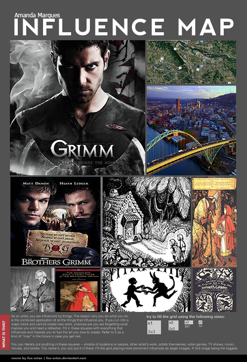

# Amanda Marques

## Sobre mim

   UFRN - Universidade Federal do Rio Grande do Norte
   
   Bacharelado em Tecnologia da Informação
## Portfólio   
### Games

  
### APLISTIA   
  Jogo sobre uma estória ficcionária sobre um Deus grego que está atrás causar caos onde passa. Para isso ele precisa conseguir pegar a caixa de pandora, que está bem guardada álias... E ai? você consegue ajuda-lo?  
  
  
  
### 42   
  Nos foi proposto um jogo com o tema mensagem, o que é melhor para passar mensagens ou mostra-lás do que uns bons enigmas.  
  
  
   
### The Journey   
  Um jogo sobre uma jovem mamãe que tem que passar pela sua grávidez de forma saúdavel e inteligente, tendo que enfrentar grandes responsabilidades como tomar remédios, driblar o enjôo e a azía, entre outros.          
  
### Influence Map
Esse pode ser meu próximo joguinho, com tema mistério.
   
Um jogo sobre resolver mistérios em um cidade em que nada é o que parece. Onde você descobre que a vida que leva é uma grande ilusão. Inspirada nos contos de fada (nada fofos) dos Irmãos Grimm, com um toque policial da série televisiva Grimm.

Para contato:   
   
amanda001.ac@gmail.com
* * *

[//]: # (Não aparece)

