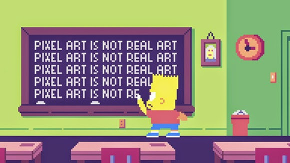

Criando **minha** _página_ ~~principal~~.  
(#) deixa as letras maiores e da pra fazer titulos e subtitulos

# Sobre mim
  Aluno de jogos fazendo jogos.
# Portfólio

## Games

## Artes
 
 
 
 

## Projetos

* Proj Teatro
* Proj Música
* Proj Jogos  
1 A  
2 B  
3 C 

(**) negrito  
(_)  itálico  
(~~) riscado  
3 (*) cria linha horizontal  
* * *

[//]: # (Não aparece)

